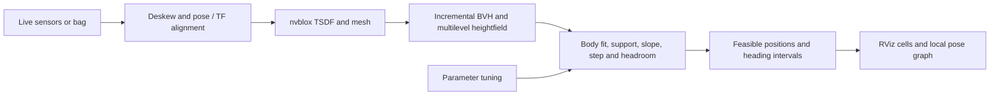

<div align="center">

# SE(2) Nvblox Traversability

**From 3D reconstruction to terrain you can reason about.**

Geometry-based traversability for quadruped robots: narrow passages, stairs, and multiple floors.

[English](README.md) · [简体中文](README.zh-CN.md)

[](https://github.com/CUDDLIU/se2-nvblox-traversability/actions/workflows/core.yml)
[](https://docs.ros.org/en/humble/)
[](LICENSE)

[Demo](#demo) · [Quick start](#quick-start) · [Global planning](docs/global-planning.md) · [Architecture](docs/architecture.md) · [Jetson integration](docs/jetson.md) · [Validation](docs/validation.md)

</div>

SE(2) Nvblox Traversability turns an incremental [nvblox](https://github.com/nvidia-isaac/nvblox) mesh into a local map of feasible robot positions and headings. It checks the robot's physical envelope, floor support, step height, slope, and headroom, then shows how much heading freedom remains in each cell. A ROS 2 interface supports sensor recording, reconstruction from bags, parameter comparison, and RViz inspection.

Developed on an M20 robot with a Jetson Orin NX, dual LiDAR, and a RealSense D435i. The geometry core also builds and runs on a Linux CPU without ROS, CUDA, or robot hardware.

## Demo

[](https://github.com/CUDDLIU/se2-nvblox-traversability/raw/refs/heads/main/docs/media/demo-full.mp4)

**[Watch or download the full demo · 3:56 · MP4](https://github.com/CUDDLIU/se2-nvblox-traversability/raw/refs/heads/main/docs/media/demo-full.mp4)**

Recorded September 30, 2026. The preview contains two short excerpts at original speed; the full video retains the complete recording. Rainbow colors encode mesh height. Green and orange cells encode current traversability; blue areas retain historical results.

<details>
<summary>Staircase view</summary>


</details>

## Highlights

- **Physical fit in narrow passages.** Feasible poses can lie inside a grid cell and between sampled headings. A passage just wide enough for the body can retain a chain of orange cells through the existing classifier.
- **Heading freedom at a glance.** Deep orange indicates a very narrow feasible heading interval; lighter orange indicates more freedom. Green requires feasibility across all headings with the configured margins.
- **Floors stay distinct.** A multilevel heightfield and local surface connectivity prevent an upper-floor edge from becoming a spurious obstacle on the floor below.
- **Incremental geometry.** A native C++/OpenMP core updates a robot-centered window from changed mesh blocks. Historical areas remain visible with separate validity semantics.
- **Record once, compare parameters.** Record sensor inputs without mesh reconstruction, keep a bag with its map and telemetry, rebuild from LiDAR, depth, or both, and tune while replay is paused.
- **Cross-floor goal planning.** Build a static all-floor map from a bag and select a 3D goal in RViz. A paper-based A* → string pulling → heading A* planner produces a checked route through stairs. [Workflow and relation to SE(2) NavMesh →](docs/global-planning.md)
- **RViz and robot state.** Height-colored meshes, traversability cells, and an M20 joint model share the reconstruction frame. Replay suspends the live reconstruction view; a button restores it.

This is a research and integration project. It produces geometric analysis and visualization, and does not issue robot motion commands. See [current limits](#current-limits) before using the output in a planner.

## Quick start

### Run the geometry core on a CPU

Requirements: Linux, Python 3.10+, a C++17 compiler with OpenMP, and the packages in [requirements-core.txt](requirements-core.txt).

```bash
git clone https://github.com/CUDDLIU/se2-nvblox-traversability.git
cd se2-nvblox-traversability

# Ubuntu / Debian build prerequisites
sudo apt-get install build-essential python3-venv
python3 -m venv .venv
source .venv/bin/activate
python -m pip install -r requirements-core.txt

bash scripts/test_core.sh
python examples/narrow_passage.py
```

The example runs the production geometry classifier on synthetic corridors. A 0.506 m body fits the 0.506 m corridor with restricted headings; a 0.500 m corridor is rejected. Wider corridors admit larger heading intervals. These are geometric fixtures, not measurements from the demo.

The check script builds the native library and runs the focused geometry, graph, color, local-window, and floor-separation regressions, followed by the bag-management and robot-model unit tests. Hardware smoke scripts are separate and are not started by this command.

### Run on the configured Jetson

On the existing M20 deployment, the tuning interface starts with:

```bash
bash /home/nvidia/scanplanner_test/se2_terrain_check/start_after_boot.sh
```

Select a bag, enable reconstruction, choose the sensor input, and open replay in RViz. The default reconstruction profile uses LiDAR with deskewing; replay uses the **recorded poses**, rather than rerunning odometry estimation. Use **Restore live reconstruction / 恢复实时重建** to return to live input.

For a bag with a built global map, click **全局路径规划**, then use RViz **Publish Point** on the destination floor. The start defaults to the recorded bag endpoint. See the [global planning guide](docs/global-planning.md).

A fresh machine also needs the ROS 2/nvblox stack, sensor drivers, odometry, calibrated transforms, and deployment services. Those external components are not installed by the CPU quick start. Follow the [Jetson integration guide](docs/jetson.md) and [bag workflow](bag_tools/README.md).

## How it works



The classifier first uses conservative grid footprints to establish feasibility efficiently. Unresolved states are refined against the current mesh using the physical body footprint. Local graph nodes retain the actual feasible poses; refined edges check the swept footprint between poses. Changed geometry and parameters invalidate affected results. See [architecture and interfaces](docs/architecture.md).

| Display | Meaning |
| --- | --- |
| Green | All headings feasible with configured clearance margins |
| Deep → light orange | Increasing total feasible heading angle; physical fit may have insufficient lateral comfort margin |
| Blue | Historical geometry results, not current traversability permission |
| Rainbow mesh | Surface height, independent of traversability color |

## Validation

The September 29 validation used a **326.63 s LiDAR replay on Jetson Orin NX 16 GB**. These results describe that run; the demonstration video is a separate recording.

| Measurement | Recorded result |
| --- | ---: |
| LiDAR frames integrated | 3,264 / 3,266; 2 startup drops |
| Distinct mesh geometry updates | 12.42 Hz |
| Distinct traversability results | **1.93 Hz** |
| Oldest-input-to-result latency, median / P95 | **940 / 1,425 ms** |
| Doorway graph checks at 75 / 85 / 90 s | Connected in all three frozen mesh snapshots |
| Geometry / graph / display regression suite | 21 tests passed on x86 and Jetson |

The finer physical-clearance classifier currently has substantial CPU cost. **The full pipeline did not meet its >10 Hz / P95 <50 ms target.** Mesh publishing rate is not traversability update rate. Snapshot connectivity checks do not establish route connectivity throughout a complete building. [Method, scope, and machine-readable results →](docs/validation.md)

## Repository layout

| Path | Purpose |
| --- | --- |
| [`terrain_variants/local_window/`](terrain_variants/local_window/) | Current replay geometry core, pose graph, and display |
| [`terrain_variants/baseline/`](terrain_variants/baseline/) | Earlier reference implementation for comparisons |
| [`terrain_variants/deskew/`](terrain_variants/deskew/) · [`fast_lidar/`](terrain_variants/fast_lidar/) | LiDAR motion compensation and Jetson CUDA conversion |
| [`bag_tools/`](bag_tools/) | Recording, reconstruction, tuning integration, lifecycle management |
| [`global_planner/`](global_planner/) | Complete-bag map building, yaw-layered ASA planning, and RViz 3D goals |
| [`robot_model/`](robot_model/) | M20 joint-state adapter, namespaced TF, and upstream model |
| [`launch/`](launch/) · [`config/`](config/) | ROS 2 package launch and configuration |
| [`deployment/jetson/`](deployment/jetson/) | Existing deployment entry points and configuration snapshots |
| [`examples/`](examples/) · [`docs/`](docs/) | CPU example, integration notes, validation, and demo |

## Current limits

- Geometry quality depends on sensing, calibration, odometry, and TSDF integration. Reflective surfaces, missing observations, and open-riser stairs can still leave incomplete geometry.
- Ground support is checked at finite resolution. The model is a body envelope with terrain constraints, not a legged dynamics, contact, or gait-feasibility solver.
- Live classification is valid within the current local window. The global planner checks paths against a frozen complete-bag mesh; historical displays and saved routes do not establish validity after the environment changes.
- Raw field bags are not included. Synthetic tests are reproducible from this repository; field results are documented with aggregate evidence.
- Jetson integration contains deployment-specific paths and service dependencies. CUDA adapters must be built against the installed nvblox library; prebuilt binaries are not distributed.

## Contributing

See [CONTRIBUTING.md](CONTRIBUTING.md) for the core checks and useful information to include in a bug report. Changes to collision or support behavior should include a geometry fixture that demonstrates the intended result.

## License and acknowledgments

Project code is licensed under [Apache 2.0](LICENSE). Third-party model assets and reference sources retain their own licenses; see [THIRD_PARTY_NOTICES.md](THIRD_PARTY_NOTICES.md).

Built with [NVIDIA nvblox](https://github.com/nvidia-isaac/nvblox), [Isaac ROS nvblox](https://github.com/NVIDIA-ISAAC-ROS/isaac_ros_nvblox), and [ROS 2](https://github.com/ros2). M20 model assets come from [DeepRoboticsLab](https://github.com/DeepRoboticsLab/deep_robotics_model). This is an independent project and is not an official release by these organizations.
