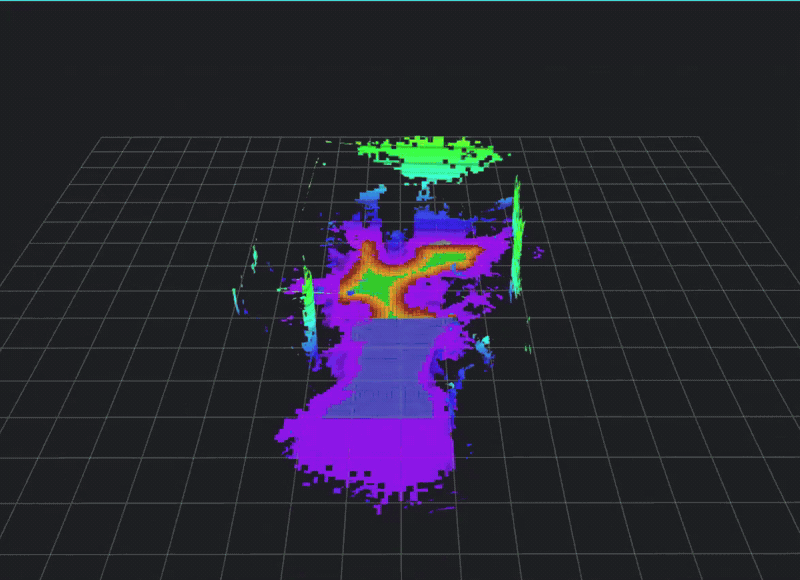
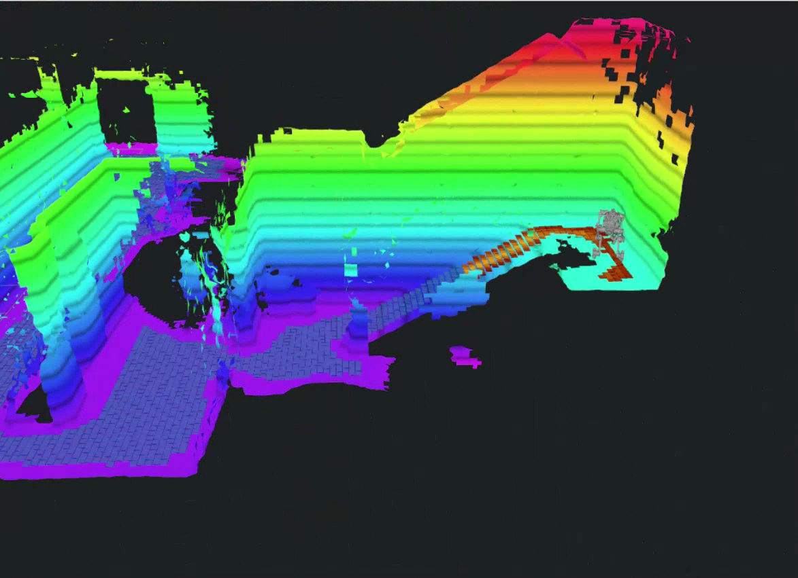

<div align="center">

# SE(2) Nvblox Traversability

**从三维重建，走向可解释的地形通行分析。**

面向四足机器人的几何通行性分析：狭窄通道、楼梯与多楼层环境。

[English](README.md) · [简体中文](README.zh-CN.md)

[](https://github.com/CUDDLIU/se2-nvblox-traversability/actions/workflows/core.yml)
[](https://docs.ros.org/en/humble/)
[](LICENSE)

[演示](#演示) · [快速开始](#快速开始) · [全局规划](docs/global-planning.md#简体中文) · [算法架构](docs/architecture.md) · [Jetson 部署](docs/jetson.md) · [验证结果](docs/validation.md)

</div>

SE(2) Nvblox Traversability 将 [nvblox](https://github.com/nvidia-isaac/nvblox) 的增量 Mesh 转换为包含机器人可行位置与朝向的局部通行地图。算法检查实际机身轮廓、地面支撑、台阶、坡度和顶部净空，并通过栅格颜色表达可通行朝向的自由度。ROS 2 调参界面支持传感器录制、bag 重建、参数对比和 RViz 查看。

项目基于 M20 机器人、Jetson Orin NX、双雷达和 RealSense D435i 开发。几何核心也可以在 Linux CPU 上独立编译运行，无需 ROS、CUDA 或机器人硬件。

## 演示

[](https://github.com/CUDDLIU/se2-nvblox-traversability/raw/refs/heads/main/docs/media/demo-full.mp4)

**[观看或下载完整演示 · 3 分 56 秒 · MP4](https://github.com/CUDDLIU/se2-nvblox-traversability/raw/refs/heads/main/docs/media/demo-full.mp4)**

录制于 2026 年 9 月 30 日。动态预览选取两个片段，保持原速；完整视频保留全部录屏内容。彩虹色表示 Mesh 高度，绿色和橙色表示当前通行性，蓝色区域保留历史结果。

<details>
<summary>查看楼梯场景</summary>



</details>

## 核心能力

- **按实际轮廓判断狭窄通道。** 可行位姿能够位于格子内部、采样朝向之间；仅容得下机身的通道，也可以通过原有分类器自然保留一串橙色格子。
- **用颜色表达朝向自由度。** 深橙表示可行朝向区间很窄，浅橙表示朝向空间更大；绿色要求所有朝向均满足设置的余量。
- **保持楼层独立。** 多层高度场结合局部表面连通关系，避免把上层边缘直接投影成下层障碍。
- **增量处理当前区域。** C++/OpenMP 核心从变化的 Mesh 块更新机器人附近窗口；历史区域继续显示，并保留独立的有效性语义。
- **一次录制，多次调参。** 录制时关闭 Mesh 重建以节省资源；bag、地图与遥测绑定管理；支持纯雷达、深度或融合重建，以及暂停回放后继续调参。
- **点选跨楼层目标。** 从整包构建静态多层通行图，在 RViz 点击三维目标，经 A* → 路径拉直 → 朝向 A* 得到通过楼梯的已检查路径。[使用方法及与 SE(2) NavMesh 论文的对应关系 →](docs/global-planning.md#简体中文)
- **统一 RViz 显示与机身状态。** 显示高度着色 Mesh、通行栅格与 M20 实测关节模型；回放时暂停实时重建视图，并提供恢复按钮。

本项目用于研究与系统集成，输出几何分析和可视化，不发送机器人运动指令。接入规划器前请阅读[当前限制](#当前限制)。

## 快速开始

### 在 CPU 上运行几何核心

依赖：Linux、Python 3.10+、支持 OpenMP 的 C++17 编译器，以及 [requirements-core.txt](requirements-core.txt) 中的 Python 包。

```bash
git clone https://github.com/CUDDLIU/se2-nvblox-traversability.git
cd se2-nvblox-traversability

# Ubuntu / Debian 编译依赖
sudo apt-get install build-essential python3-venv
python3 -m venv .venv
source .venv/bin/activate
python -m pip install -r requirements-core.txt

bash scripts/test_core.sh
python examples/narrow_passage.py
```

示例使用实际几何分类器计算构造通道：0.506 m 宽的机身在 0.506 m 通道内保留受限朝向，0.500 m 通道被拒绝；通道变宽时，可行朝向范围随之增加。这些是可复现的几何测试场景，并非演示视频中的测量结果。

检查脚本编译原生库，运行几何、图连接、颜色、局部窗口和楼层分离回归，再运行 bag 管理与关节模型单元测试。实机冒烟脚本独立保留，不会随此命令启动。

### 启动已配置的 Jetson

现有 M20 部署的调参界面启动命令：

```bash
bash /home/nvidia/scanplanner_test/se2_terrain_check/start_after_boot.sh
```

选中 bag，启用重新建图，选择传感器输入，再打开 RViz 回放。默认使用带去畸变的纯雷达方案；重建使用**包内已录位姿**，不会重新估计里程计。点击 **恢复实时重建** 返回实时输入。

对于已构建全局图的 bag，点击 **全局路径规划**，再在 RViz 用 **Publish Point** 点击目标楼层地面。默认起点为录制终点，详见[全局规划说明](docs/global-planning.md#简体中文)。

全新机器还需要 ROS 2/nvblox、传感器驱动、里程计、标定 TF 和部署服务。CPU 快速开始不会安装这些外部组件，具体见 [Jetson 集成说明](docs/jetson.md) 和 [bag 操作流程](bag_tools/README.md)。

## 工作原理


算法先使用保守栅格足迹快速确认可行状态；对于仍未确定的状态，再根据当前 Mesh 检查实际机身轮廓。局部图节点保留真实可行位姿，细化后的边检查位姿之间运动时扫过的轮廓。观测或参数变化会撤销受影响的旧结果，详见[算法与接口](docs/architecture.md)。

| 显示 | 含义 |
| --- | --- |
| 绿色 | 所有朝向均满足设置的净空余量 |
| 深橙 → 浅橙 | 可行朝向总角宽增加；实际轮廓可通过，但可能不足设置的侧向余量 |
| 蓝色 | 历史几何结果，不代表当前通行许可 |
| 彩虹色 Mesh | 表面高度，与通行性颜色相互独立 |

## 验证结果

9 月 29 日在 **Jetson Orin NX 16 GB** 上完成了 **326.63 秒纯雷达回放**。下表描述这次测试；首页演示视频为另一次录屏。

| 指标 | 实测结果 |
| --- | ---: |
| 完成积分的雷达帧 | 3,264 / 3,266；启动阶段丢弃 2 帧 |
| 不同 Mesh 几何更新 | 12.42 Hz |
| 不同通行性结果更新 | **1.93 Hz** |
| 最旧输入至结果延迟，中位数 / P95 | **940 / 1,425 ms** |
| 75 / 85 / 90 秒门口位姿图检查 | 三个固定 Mesh 快照均连通 |
| 几何、图连接与颜色回归 | x86 与 Jetson 均通过 21 项测试 |

精细轮廓判定目前仍有较高 CPU 开销，**整条流程尚未达到 >10 Hz、P95 <50 ms 的目标**。Mesh 发布频率不等于通行性更新频率；三个快照的连通性也不代表整栋建筑全程路径已验证。[测试方法、范围与机器可读数据 →](docs/validation.md)

## 目录结构

| 路径 | 用途 |
| --- | --- |
| [`terrain_variants/local_window/`](terrain_variants/local_window/) | 当前回放使用的几何核心、位姿图和显示 |
| [`terrain_variants/baseline/`](terrain_variants/baseline/) | 用于对照的早期实现 |
| [`terrain_variants/deskew/`](terrain_variants/deskew/) · [`fast_lidar/`](terrain_variants/fast_lidar/) | 雷达运动补偿与 Jetson CUDA 转换 |
| [`bag_tools/`](bag_tools/) | 录制、重建、调参集成和包管理 |
| [`global_planner/`](global_planner/) | 整包全局图、朝向分层 ASA 规划和 RViz 三维选点 |
| [`robot_model/`](robot_model/) | M20 关节转换、专用 TF 和上游模型 |
| [`launch/`](launch/) · [`config/`](config/) | ROS 2 包启动与配置 |
| [`deployment/jetson/`](deployment/jetson/) | 现有部署入口和配置快照 |
| [`examples/`](examples/) · [`docs/`](docs/) | CPU 示例、集成说明、验证和 Demo |

## 当前限制

- 几何质量依赖观测、标定、里程计和 TSDF 积分。反光表面、缺失观测和无立面的踏板楼梯仍可能出现重建缺口。
- 地面支撑采用有限分辨率检查；模型是机身包络与地形约束，不是四足动力学、接触状态或步态可行性求解器。
- 实时分类的有效性范围为当前局部窗口。全局规划针对整包的静态 Mesh 检查路径；环境变化后，历史显示和保存路径不能代表当前通行许可。
- 仓库不包含原始实地 bag。构造场景测试可直接复现，实地结果以汇总证据记录。
- Jetson 集成保留了部署相关路径和服务依赖。CUDA 适配器需要根据已安装的 nvblox 库构建，不提供预编译二进制。

## 参与贡献

检查命令和问题反馈要求见 [CONTRIBUTING.md](CONTRIBUTING.md)。修改碰撞或支撑判据时，请提供能说明预期行为的几何测试场景。

## 许可与致谢

项目代码采用 [Apache 2.0](LICENSE)。第三方模型与参考源码保留各自许可，详见 [THIRD_PARTY_NOTICES.md](THIRD_PARTY_NOTICES.md)。

本项目使用 [NVIDIA nvblox](https://github.com/nvidia-isaac/nvblox)、[Isaac ROS nvblox](https://github.com/NVIDIA-ISAAC-ROS/isaac_ros_nvblox) 和 [ROS 2](https://github.com/ros2)，M20 模型来自 [DeepRoboticsLab](https://github.com/DeepRoboticsLab/deep_robotics_model)。本项目独立开发，并非上述组织的官方发布。
