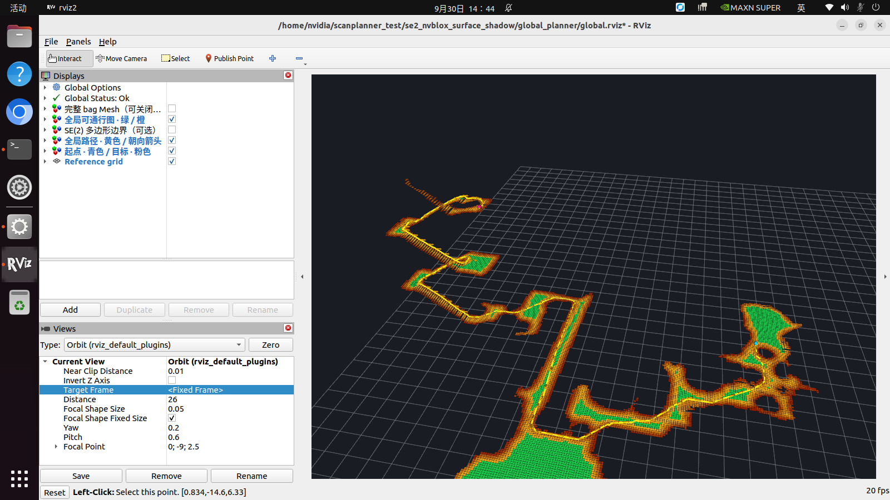

# Cross-floor global planning

[English](#english) · [简体中文](#简体中文)

## English

Build a static map from a complete sensor bag, then click a **3D surface point** in RViz to plan through stairs between floors. The start defaults to the robot's recorded final pose, projected onto the floor. Outputs are a geometric path and headings; no robot motion commands are sent.

The intended downstream local planner is the installed **ScanPlanner**. Its current reference-path handling flattens height and drops intermediate headings, so direct remapping is insufficient. See the [verified interface differences and integration contract](scanplanner-integration.md).

### Relation to SE(2) NavMesh

This is an independent implementation based on [SE(2) NavMesh](https://se2-navmesh.github.io/) and [its paper](https://se2-navmesh.github.io/static/SE2_anonymous.pdf), particularly the map representation and the A*–String Pulling–A* (ASA) pipeline in Section V-C. At implementation time the project site listed the authors' code as forthcoming. This repository is not their official release or an exact reproduction of their experiments.

| Paper concept | Implementation |
| --- | --- |
| Multiheight surfaces and yaw-dependent feasibility | The existing mesh classifier, evaluated over the entire final bag mesh; vertically overlapping floors remain distinct |
| Polygon regions and adjacent yaw layers | Convex regions grouped by feasible heading masks; shared-edge portals and in-place heading transitions |
| Initial A* | Portal midpoint graph with directional translation and rotation costs following Equations 27–28 |
| String pulling | Numerical minimization of 3D path length through the ordered shared portal segments |
| Second A* | Heading selection along the refined path, with physical motion checks |

Deployment adaptations are explicit. Reconstruction uses **nvblox**, whereas the paper uses Voxblox. The existing sub-cell classifier can find an actual pose between voxel centers and heading samples. Such a pose does **not** certify a complete cell or yaw interval: these transitions retain their exact geometric anchors during string pulling and require swept-body checks. Complete continuous-yaw footprint proofs can be reused only where the source cells certify them. Lazy edge checking, a native CSR A* implementation, and a relaxed-graph heuristic reduce search cost. If refinement fails or increases cost, the checked initial path is retained.

The implementation discretizes floor support and motion checks. It models an upright body envelope and holonomic movement, not leg contact sequences or dynamic feasibility. The configured speeds (0.4 m/s longitudinal, 0.2 m/s lateral, 0.6 rad/s yaw) weight the search objective; they are not commands or predictions of actual traversal time.

### Use the configured Jetson

1. Start the existing tuning interface with `bash /home/nvidia/scanplanner_test/se2_terrain_check/start_after_boot.sh`.
2. In **Bag 录制 / 回放 / 管理**, select a bag with a built global map and click **全局路径规划**.
3. In RViz, select **Publish Point** and click the green/orange floor or stair tread on the desired level. The yellow path includes heading arrows. Mesh is hidden by default to make surface picking easier; enable it for geometry inspection. Keep it disabled and rotate the view if another floor occludes the target.
4. To change the start, click **在 RViz 设起点**, then use Publish Point once. The start heading is retained. **恢复 bag 终点** restores the recorded final pose.
5. **关闭回放** closes the planning viewer. **恢复实时重建** returns to the existing live view.

Use Publish Point rather than a planar goal tool: the clicked Z coordinate selects the floor. A nearby surface is projected within 0.25 m; a point in midair or without a feasible connection produces an error and clears the previous path. The planner never joins floors merely because their XY coordinates overlap.

The saved map uses its **build-time parameters**. Live/replay sliders do not modify an already built static graph. Rebuild the graph from its `mesh.npz` after changing the saved `terrain_config.yaml` if a comparison with other geometry parameters is needed.

### Build another bag

On the configured Jetson, after closing any active recording/replay:

```bash
project=/home/nvidia/scanplanner_test/se2_nvblox_surface_shadow
bash "$project/global_planner/build_bag.sh" "$project/bags/BAG_ID"
# Open the most recently built map, or pass its map directory explicitly.
bash "$project/global_planner/start.sh"
```

This requires the existing LiDAR adapter, deskew executable, nvblox installation and recorded pose/TF inputs. It replays sensors at 1× with recorded poses in isolated ROS domain 78, saves the final incremental mesh including deletions, and classifies all floors. The viewer uses domain 79. Live service configuration is unchanged.

All outputs belong to `bags/BAG_ID/global_plans/map_TIMESTAMP/`: `mesh.npz`, `field.npz`, `navmesh.json`, reconstruction/configuration logs, `runtime/`, and saved `queries/`. Bag deletion/restoration includes these files; an open planning session protects its bag from deletion. The graph records the source mesh hash and refuses to load against a changed mesh.

### ROS interfaces

All points use the saved frame, currently `nvblox_odom`.

| Interface | Type | Meaning |
| --- | --- | --- |
| `/clicked_point` | `geometry_msgs/PointStamped` | 3D goal; heading is selected by the planner |
| `/se2_global/start` | `geometry_msgs/PointStamped` | Change the starting surface point |
| `/se2_global/goal_pose` | `geometry_msgs/PoseStamped` | Optional exact goal heading |
| `/se2_global/pick_start`, `/se2_global/reset_start` | `std_srvs/Trigger` | Use the next click as start / restore bag end |
| `/se2_global/path` | `nav_msgs/Path` | Floor XYZ and body yaw for every checked path state |
| `/se2_global/status` | `std_msgs/String` | JSON status, timing, path metrics, or failure reason |
| `/se2_global/{mesh,traversability,polygons,path_markers,query_markers}` | `visualization_msgs/MarkerArray` | Retained static map and query visualization |

### Validation and scope



The September 29, 326.63-second LiDAR bag produced 360,521 mesh triangles, 9,976 traversable spans, 5,879 polygons, and 11,440 portals. A query from the recorded endpoint to the upper level produced a **47.0 m** path with Z ranging from **−0.68 to 5.69 m**, using all three ASA stages. A separate RViz mouse click on the upper landing produced a 50.6 m path reaching Z=6.34 m in 15.42 s after earlier queries. Every returned segment had either a complete voxel-mask proof or a metric swept-body check. These values describe one field query, not complete building-wide reachability. On Jetson, the first query took 34.85 s; the repeated query with cached geometric rejections took 13.91 s. [Machine-readable evidence](validation/global-planning-20260930.json).

`bash scripts/test_core.sh` includes synthetic global-planner regressions for overlapping disconnected floors, a 3 m stair connection returning above the start, a missing floor, exact heading endpoints, body-width narrow passages including a non-bin angle, repeated queries after failure, and changed-mesh rejection. These planner tests also passed on the Jetson. The ROS smoke check verifies path publication, invalid-goal clearing, and repeated queries:

```bash
source /opt/ros/humble/setup.bash
ROS_DOMAIN_ID=79 ROS_LOCALHOST_ONLY=1 python3 global_planner/smoke_ros.py --goal X Y Z
```

The map describes the final reconstructed static geometry. Later obstacles, odometry error, unobserved surfaces and finite-resolution support checks remain limitations. ASA searches a discretized graph and does not establish a globally optimal continuous trajectory. Some selected points can have no path; the implementation reports this instead of adding artificial connections.

## 简体中文

整包重建得到静态全局通行图后，可在 RViz 点击具有真实高度的地面目标，通过楼梯进行跨楼层规划。默认起点为 **bag 录制终点在地面的投影**；输出包含位置与朝向，不发送运动控制指令。

最终面向现有 **ScanPlanner 局部规划器**接入。已核查其高度覆盖、1.5 米抽稀和中途朝向丢失问题，详见[接口核查与适配要求](scanplanner-integration.md#中文说明)；当前尚未完成跨楼层闭环执行适配。

### 与论文的对应关系

实现依据 [SE(2) NavMesh 项目](https://se2-navmesh.github.io/)及[论文](https://se2-navmesh.github.io/static/SE2_anonymous.pdf)，采用多层高度场、朝向相关多边形图，以及 V-C 节的 **A* → 三维路径拉直 → 朝向 A***。平移和旋转代价对应公式 27–28。官网当时尚未公开作者代码，因此这是独立实现，并非作者官方代码或实验结果的完整复现。

现有系统继续使用 nvblox 重建；论文使用 Voxblox。针对原算法已经支持的格内可行位置与非采样朝向，规划保留真实几何位姿。局部可行状态不会被扩大为整个格子或朝向区间都可行：拉直时保留这些受限位置，逐段检查运动扫过的机身；只有源格子具有完整扫掠足迹证明时才复用栅格可行性。拉直后的朝向优化失败或代价增加时，保留已检查的初始路径。

### 操作方法

1. 使用原启动命令打开调参界面，进入 **Bag 录制 / 回放 / 管理**。
2. 选中已经构建全局图的 bag，点击 **全局路径规划**。
3. 在 RViz 选择 **Publish Point**，点击目标楼层的绿色或橙色地面。黄色路径带有机身朝向箭头。默认关闭 Mesh 显示以便选点，需要查看重建几何时可勾选；若上层遮挡目标，请旋转视角。
4. **在 RViz 设起点**：下一次 Publish Point 点击设置起点，保留原朝向。**恢复 bag 终点**：恢复录制终点。
5. **关闭回放** 关闭规划窗口；**恢复实时重建** 返回原实时视图。

目标高度参与楼层选择，不要用二维目标工具。选点最多向附近表面投影 0.25 m；点在空中或找不到可行路径时会提示失败并清除旧路径。楼层不会因为 XY 重合而直接连接。

静态图采用**构建时的参数**，现有实时／回放滑块不会自动改变它。其他 bag 可使用上方 `build_bag.sh` 命令整包构建；输出全部保存在该 bag 的 `global_plans/` 内，随 bag 一并删除或恢复。修改保存的 `terrain_config.yaml` 后，可用 `build.py mesh.npz` 重新分类作参数比较。

### 已验证的范围

本次 326.63 秒 bag 生成 360,521 个 Mesh 三角形、9,976 个可通行跨度、5,879 个多边形和 11,440 个连接门户。录制终点到上层的实测查询完成三个 ASA 阶段，路径约 **47 米**，高度范围 **−0.68～5.69 米**。每段都有完整栅格证明或实际机身扫掠检查。Jetson 首次规划为 34.85 秒，缓存几何拒绝结果后的重复查询为 13.91 秒，详见[机器可读记录](validation/global-planning-20260930.json)。另一次实际 RViz 鼠标点选上层平台得到 50.6 米路径，最高 Z=6.34 米，耗时 15.42 秒。Jetson 已验证 ROS 路径发布、失败清空和再次规划；CPU 回归也覆盖了有／无楼梯连接的重叠楼层、断面、窄通道、非采样朝向与失效缓存。

这是基于最终 Mesh 的静态几何路径。它仍受感知、里程计和有限分辨率支撑检查影响，不代表动态障碍、腿部接触或步态已得到验证；离散图搜索也不等于连续空间中的全局最优轨迹。具体位置可能没有可行路径，此时会明确报告失败。
